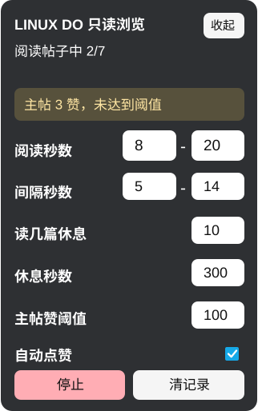

# LINUX DO Read-Only Browse Helper

一个用于 [LINUX DO](https://linux.do/) 的只读浏览用户脚本。

脚本会在页面右下角显示一个手动控制面板，用于按可配置的停留时间阅读最新帖子、滚动页面并返回列表继续浏览。它只做浏览相关操作，不会自动点赞、评论、收藏、发送消息或执行其他互动行为。

## 功能

- 在 `https://linux.do/*` 页面显示“LINUX DO 只读浏览”控制面板
- 手动开始或停止自动只读浏览
- 自动从最新列表选择未读帖子
- 在帖子页随机停留、分段滚动，模拟正常阅读节奏
- 自动返回 `https://linux.do/latest` 继续查找下一篇帖子
- 记录最近浏览过的帖子，减少重复打开
- 可清空本地浏览记录
- 可显示今日已读帖子数量，并按本地日期自动归零
- 可配置阅读秒数和间隔秒数
- 可设置阅读指定篇数后自动休息一段时间
- 可收起悬浮控制面板，并在刷新后保持收起状态
- 可设置主帖点赞数阈值，达到阈值时提示并高亮原生点赞控件
- 可开启辅助自动点赞：脚本运行中且主帖点赞数达到阈值时，自动点击主帖点赞按钮
- 兼容没有反应计数块、但在主帖统计区显示点赞数的帖子

## 界面预览



## 安装

1. 安装用户脚本管理器，例如 Tampermonkey、Violentmonkey 或 Greasemonkey。
2. 打开 GitHub Raw 安装地址：[linuxdo-read-only-browse.user.js](https://raw.githubusercontent.com/baiya123/linuxdo-read-plugin/main/linuxdo-read-only-browse.user.js)。
3. 用户脚本管理器弹出安装页后点击安装。
4. 后续脚本管理器会通过脚本头部的 `@downloadURL` 和 `@updateURL` 从 GitHub Raw 检查更新。
5. 打开 `https://linux.do/latest`，页面右下角会出现控制面板。

## 使用

1. 打开 LINUX DO 任意页面。
2. 在右下角面板中设置阅读秒数、间隔秒数，以及读几篇后休息多久。
3. 点击“开始”。
4. 脚本会自动前往最新列表，打开帖子，只读停留并滚动，然后返回列表继续。
5. 需要停止时点击“停止”。

## 面板说明

| 控件 | 说明 |
| --- | --- |
| 阅读秒数 | 每篇帖子停留和滚动阅读的随机时间范围 |
| 今日已读 | 今日完整阅读完成的帖子数量，按本地日期自动归零 |
| 间隔秒数 | 打开帖子、返回列表等动作之间的随机等待时间范围 |
| 读几篇休息 | 完整读完多少篇帖子后进入长休息 |
| 休息秒数 | 达到阅读篇数后暂停多久再继续 |
| 主帖赞阈值 | 主帖当前点赞数达到该值时提示并高亮点赞控件；设置为 `0` 表示关闭提示和自动点赞 |
| 自动点赞 | 开启后，仅在脚本运行中且主帖点赞数达到阈值时，自动点击主帖点赞按钮 |
| 收起/展开 | 隐藏面板内容或恢复显示，收起时保留小按钮便于找回 |
| 开始/停止 | 启用或暂停只读浏览 |
| 清记录 | 清空本地已浏览帖子记录 |

## 注意事项

- 本脚本只保存少量配置和浏览记录到用户脚本管理器的本地存储中。
- 自动点赞默认关闭；开启后只会对当前主帖执行点赞，不会评论、收藏、关注或私信。
- 请合理设置浏览频率，避免过短间隔造成异常访问。
- 页面结构如果发生较大变化，帖子链接识别可能需要调整。

## 开发

当前项目只有一个用户脚本文件：

```text
linuxdo-read-only-browse.user.js
```

修改后可以在用户脚本管理器中重新保存脚本，刷新 LINUX DO 页面进行验证。

## 许可证

未指定许可证。使用、分发或修改前请先确认仓库所有者意图。
